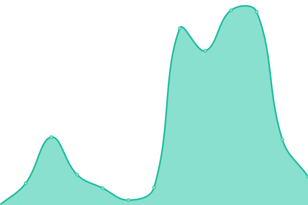

# [📈 Live Status](https://upptime.github.io/dbperu): <!--live status--> **🟩 All systems operational**

This repository contains the open-source uptime monitor and status page for [Upptime](https://upptime.js.org), powered by [Upptime](https://github.com/upptime/upptime).

With [Upptime](https://upptime.js.org), you can get your own unlimited and free uptime monitor and status page, powered entirely by a GitHub repository. We use [Issues](https://github.com/upptime/dbperu/issues) as incident reports, [Actions](https://github.com/upptime/dbperu/actions) as uptime monitors, and [Pages](https://upptime.github.io/dbperu) for the status page.

<!--start: status pages-->
<!-- This summary is generated by Upptime (https://github.com/upptime/upptime) -->
<!-- Do not edit this manually, your changes will be overwritten -->
<!-- prettier-ignore -->
| URL | Status | History | Response Time | Uptime |
| --- | ------ | ------- | ------------- | ------ |
|  [DBPERU](https://www.dbperu.com/) | 🟩 Up | [dbperu.yml](https://github.com/mperezdbperu/dbperu/commits/HEAD/history/dbperu.yml) | 

 757ms
     
 | 

<a href="https://mperezdbperu.github.io/dbperu/history/dbperu">100.00%</a>
    

|  [ApiRuc](http://java.dbperu.com:8080/ApiRuc) | 🟩 Up | [api-ruc.yml](https://github.com/mperezdbperu/dbperu/commits/HEAD/history/api-ruc.yml) | 

 95ms
     
 | 

<a href="https://mperezdbperu.github.io/dbperu/history/api-ruc">100.00%</a>
    

|  [Tentus](http://tentus.dbperulab.com/) | 🟩 Up | [tentus.yml](https://github.com/mperezdbperu/dbperu/commits/HEAD/history/tentus.yml) | 

 174ms
     
 | 

<a href="https://mperezdbperu.github.io/dbperu/history/tentus">100.00%</a>
    

|  [Api edbfact](http://161.132.192.240:81/) | 🟩 Up | [api-edbfact.yml](https://github.com/mperezdbperu/dbperu/commits/HEAD/history/api-edbfact.yml) | 

 2651ms
     
 | 

<a href="https://mperezdbperu.github.io/dbperu/history/api-edbfact">100.00%</a>
    

<!--end: status pages-->

[**Visit our status website →**](https://upptime.github.io/dbperu)

## 📄 License

- Powered by: [Upptime](https://github.com/upptime/upptime)
- Code: [MIT](./LICENSE) © [Upptime](https://upptime.js.org)
- Data in the `./history` directory: [Open Database License](https://opendatacommons.org/licenses/odbl/1-0/)
